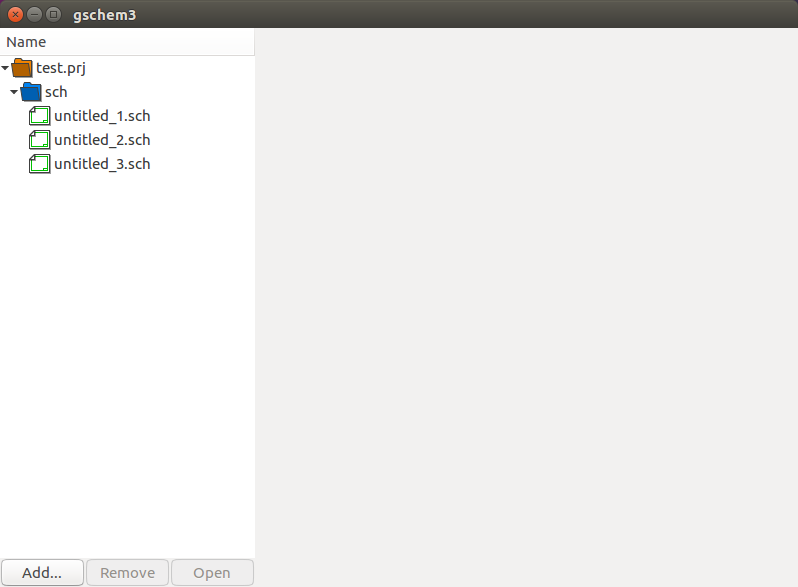

# Gschem3

This project implements a new version of gschem for Gtk+-3.0. This
project provides GUI functionality and uses
[lepton-eda](https://github.com/lepton-eda)
for the rest.

The following screenshot shows a development version of Gschem3.
Current deveopment focuses on getting the project manager in the left
pane operational.

[Coding](coding.md)
[Developer Documentation](dev/index.html)
