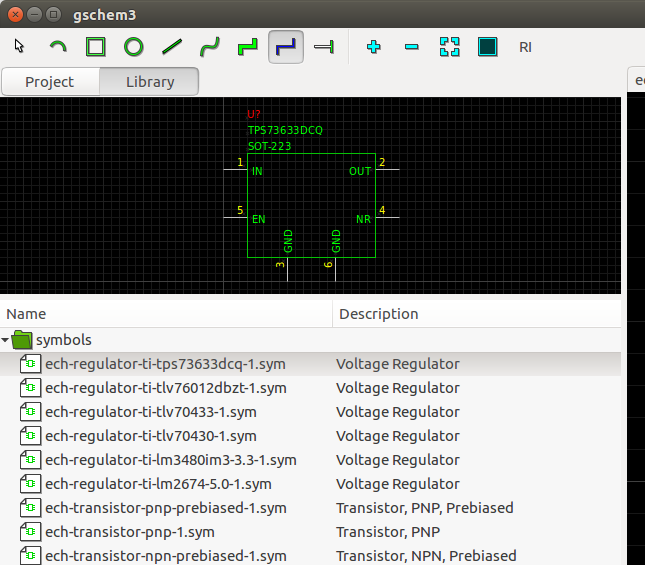

## Gschem3

This project implements a new version of gschem for Gtk+-3.0. This
project provides GUI functionality and uses
[lepton-eda](https://github.com/lepton-eda)
for the rest.

Current deveopment focuses on getting the symbol library operational.

### Project

The following screenshot shows a development version of Gschem3 with the project manager.

### Library

The following screenshot shows a development version of Gschem3 with the symbol library manager.

## Links
- [Coding Standards](coding.md)
- [Developer Documentation](dev/index.html)
